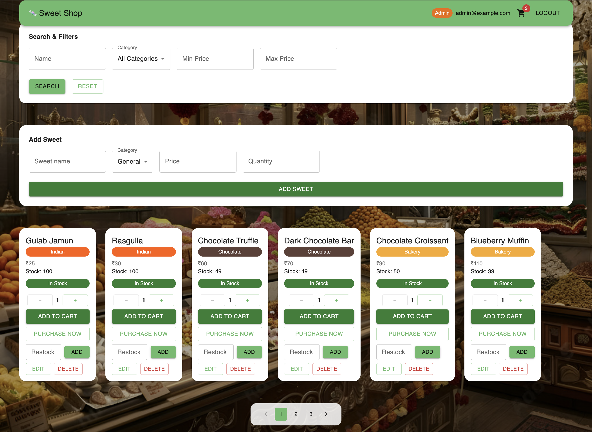
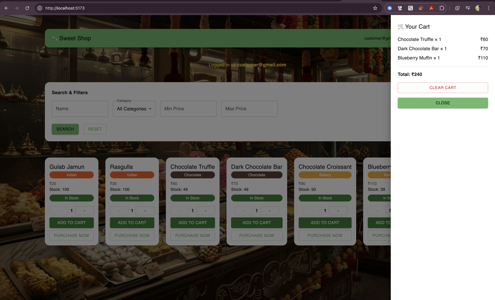
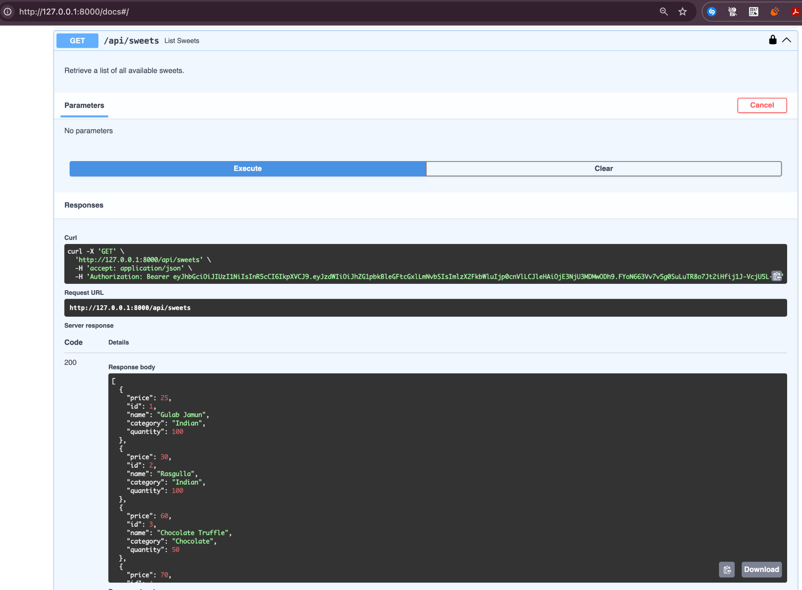

# 🍬 Sweet Shop Management System

**TDD Kata Project**

A full-stack **Sweet Shop Management System** built using **FastAPI** (backend) and **React + Material UI** (frontend).
The project follows **Test-Driven Development (TDD)**, **clean coding practices**, **JWT-based authentication**, and **role-based authorization**.

---

## 📌 Project Overview

This project simulates a real-world sweet shop inventory system where:

* Users can **register and log in**
* The **first registered user automatically becomes an Admin**
* Admin users can manage inventory (add, update, delete, restock sweets)
* Authenticated users can browse, search, and purchase sweets
* Authorization is enforced using **JWT tokens**

The backend was developed incrementally using **TDD principles** and later refactored to ensure **readability, maintainability, and clean architecture**.

---

## 🛠 Tech Stack

### Backend

* **FastAPI**
* **SQLAlchemy**
* **SQLite**
* **JWT (python-jose)**
* **Passlib (bcrypt)**
* **Pytest** (TDD)

### Frontend

* **React (Vite)**
* **Material UI (MUI)**
* **Fetch API**
* **JWT Authorization**

---

## 🔐 Authentication & Authorization

### ✅ Key Features

* JWT-based authentication
* Secure password hashing using bcrypt
* Role-based access control (Admin vs User)

### 👑 Admin Logic

* The **first user registered in a fresh database automatically becomes an Admin**
* All subsequent users are created as standard users

### 🔒 Protected Routes

| Endpoint                   | Access              |
| -------------------------- | ------------------- |
| `/api/sweets` (GET)        | Authenticated users |
| `/api/sweets` (POST)       | Admin only          |
| `/api/sweets/{id}/restock` | Admin only          |
| `/api/sweets/{id}/delete`  | Admin only          |
| `/api/sweets/search`       | Authenticated users |

---

## 📂 Project Structure

```text
sweet-shop/
│
├── backend/
│   ├── app/
│   │   ├── auth.py          # Authentication & authorization
│   │   ├── database.py      # Database configuration
│   │   ├── models.py        # SQLAlchemy models
│   │   ├── schemas.py       # Pydantic schemas
│   │   ├── sweets.py        # Sweet inventory routes
│   │   └── main.py          # Application entry point
│   └── tests/               # Pytest test cases (TDD)
│
├── frontend/
│   ├── src/
│   │   ├── App.jsx          # Main UI logic
│   │   ├── api.js           # API helper with JWT handling
│   │   ├── main.jsx         # App bootstrap & MUI theme
│   │   ├── App.css          # UI styling
│   │   └── index.css        # Global styles
│   └── index.html
│
├── screenshots/             # Project screenshots
└── README.md
```

---

## 🚀 How to Run the Project

### 1️⃣ Backend Setup

```bash
cd backend
pip install -r requirements.txt
uvicorn app.main:app --reload
```

Backend runs at:

```
http://127.0.0.1:8000
```

Swagger API documentation:

```
http://127.0.0.1:8000/docs
```

---

### 2️⃣ Frontend Setup

```bash
cd frontend
npm install
npm run dev
```

Frontend runs at:

```
http://localhost:5173
```

---

## 🧪 API Testing (Swagger)

1. Use `/api/auth/register` to create users
2. Use `/api/auth/login` to obtain a JWT access token
3. Click **Authorize** in Swagger UI
4. Paste the token as:

```
Bearer <your_access_token>
```

Locked 🔒 icons indicate that the token is attached correctly.

---

## 🖼 Screenshots

All screenshots were captured from a **local development environment**.

### Login Page


### Register Page


### Admin Dashboard



### Customer Dashboard


### Cart Drawer (Slide-in Panel)



### Swagger Authorization



---

## 🧹 Clean Code & Best Practices

* Clear separation of concerns
* Well-named variables and functions
* Meaningful inline documentation
* No unused or commented boilerplate
* SOLID-friendly backend design
* Centralized API handling on frontend
* Graceful handling of invalid JWT tokens
* Git used with meaningful, descriptive commits

---

## 🧠 Learning Outcomes

* Implemented JWT authentication from scratch
* Designed role-based authorization
* Applied TDD for backend development
* Refactored code for readability & maintainability
* Debugged real-world frontend–backend integration issues
* Practiced professional Git workflows

---

## 👤 Author

**S Guru Prasad**
TDD Kata – Sweet Shop Management System

---

## ✅ Final Status

✔ All objectives completed
✔ Backend & frontend fully functional
✔ Clean code standards followed
✔ Authorization verified locally
✔ Ready for evaluation and submission

---

## 🤖 My AI Usage

### AI Tools Used

* **ChatGPT (OpenAI)**

### How I Used AI

I used ChatGPT as a development assistant throughout this project to:

* Clarify FastAPI concepts such as dependency injection, JWT authentication, and role-based authorization
* Validate backend architecture decisions and clean code structure
* Refactor existing code to improve readability, documentation, and maintainability
* Debug integration issues between the FastAPI backend and the React frontend
* Improve frontend code organization and remove redundant logic
* Review README documentation structure and ensure project requirements were met

All core logic, implementation decisions, and debugging were performed by me. AI was used strictly as a **support tool for guidance, verification, and best-practice suggestions**.

### Reflection on AI Impact

Using AI significantly improved my development workflow by reducing time spent on repetitive research and helping me reason through architectural and debugging challenges more efficiently. It acted as a knowledgeable reviewer rather than a code generator, allowing me to maintain full ownership of the solution while improving overall code quality and confidence.

---

## 🧪 Test Report

The backend was developed following Test-Driven Development (TDD) principles.
All automated tests were executed using **pytest**.

**Test Summary:**
- Total tests executed: **8**
- Result: **All tests passed**
- Execution time: ~6.5 seconds

⚠️ A deprecation warning related to `crypt` (Python 3.13) is shown by `passlib`
and does not affect functionality or test correctness.

📄 Full test output:
- [backend/TEST_REPORT.txt](backend/TEST_REPORT.txt)

---
## 🌍 Live Demo (Optional - Brownie Points )

Frontend application deployed on **Vercel**:

🔗 https://sweet-shop-frontend-igqdtp76l-guruprasad120804-wqs-projects.vercel.app/

**Note:**  
The FastAPI backend is designed to run locally.  
Authentication and API features work when the backend is running locally.
The deployed frontend is provided for UI demonstration purposes.
